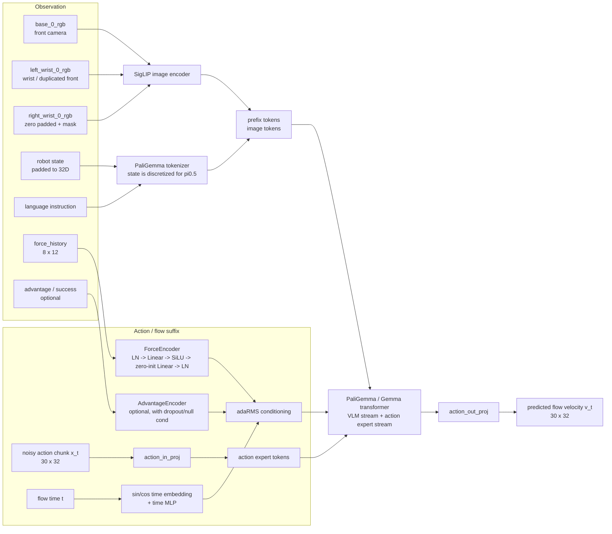
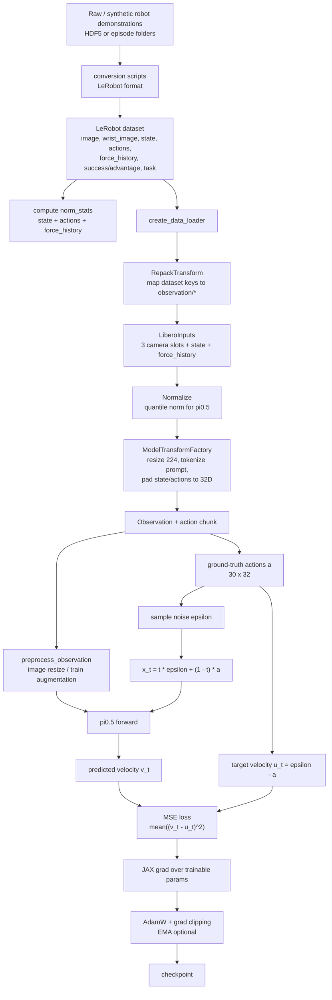

# pi0.5 force/tactile model structure and training data flow

本文档根据当前仓库代码整理，方便绘制论文中的模型训练流程图。

## 1. 模型结构图

## 2. 训练数据流与损失图

## 3. 论文图中建议标注的关键点

- 主体模型是 pi0.5: SigLIP 负责图像编码，PaliGemma/Gemma 负责多模态 token 融合和 action expert。
- pi0.5 与 pi0 的关键区别: robot state 进入离散语言 token；flow matching timestep 通过 action expert 的 adaRMSNorm 注入。
- 本仓库增加了 `ForceEncoder`: 将 `force_history` 的 8 帧、每帧 12 维左右手力/力矩展平后映射到 action expert hidden width，并加到 adaRMS 条件上。
- `AdvantageEncoder` 是可选条件分支，用于 `advantage` / `success` 标签；训练时可做 dropout 或 null conditioning，推理时可做 classifier-free guidance。
- 训练目标是 flow matching: 从真实 action chunk `a` 和高斯噪声 `epsilon` 构造 `x_t`，模型预测速度 `v_t`，监督目标是 `u_t = epsilon - a`。
- KI 模式下，prefix 的 VLM KV cache 会 `stop_gradient`，使 action/tactile loss 不更新 VLM backbone，主要更新 action-side 模块、force/advantage encoder 等。

## 4. 当前 tactile 配置的常用维度

| Item | Value |
|---|---:|
| input image views | 3 slots: front, left wrist, right wrist |
| image resolution before model | 224 x 224 |
| state dimension in dataset | usually 8 |
| action dimension in dataset | usually 7 |
| model state/action dimension | 32 after padding |
| action horizon | 30 in tactile configs |
| force history | 8 x 12 |
| force encoder hidden dim | 256 |
| advantage encoder hidden dim | 256 when enabled |

## 5. Code reference map

- Model: `src/openpi/models/pi0.py`
- pi0.5 config and tactile options: `src/openpi/models/pi0_config.py`
- Data repack and Libero/tactile config: `src/openpi/training/config.py`
- Data loader: `src/openpi/training/data_loader.py`
- Data transforms: `src/openpi/transforms.py`
- Libero input/output transform: `src/openpi/policies/libero_policy.py`
- Training loop: `scripts/train.py`
