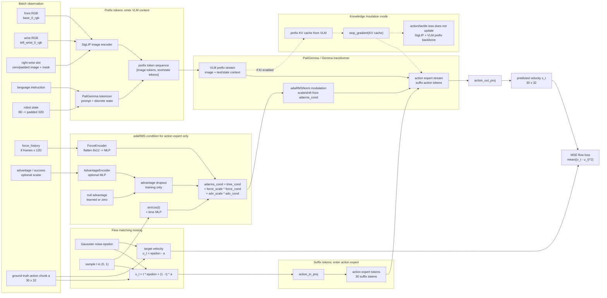
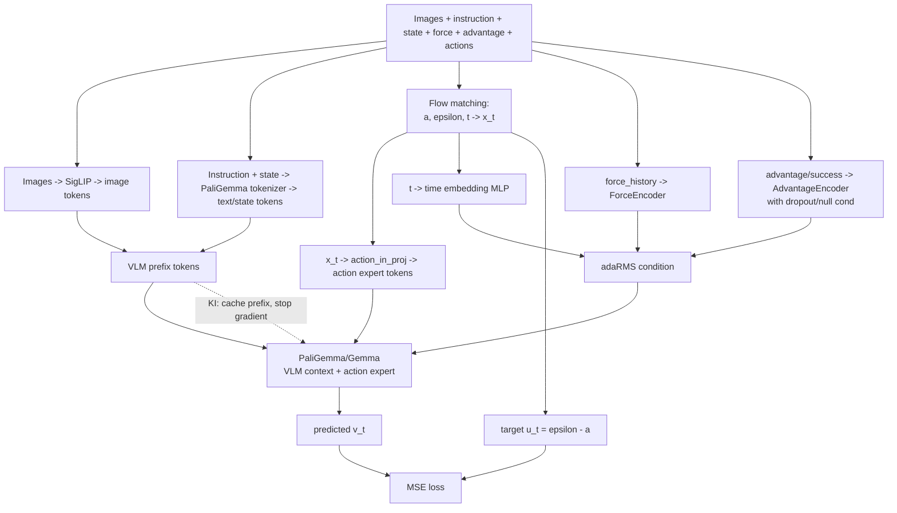

# pi0.5 tactile token-level framework

这张图重点区分三类信息流：

- **VLM / prefix tokens**: 图像 token、语言 token、pi0.5 的离散 state token。
- **Action expert / suffix tokens**: noisy action chunk `x_t` 投影后的 action tokens。
- **adaRMS conditioning**: timestep、force、advantage/success 编码后相加，只调制 action expert 分支。

## Token-level framework



## 简化版论文框架图



## 图中应该强调的机制

1. **哪些 token 进入 VLM**

   - 三路图像经过 SigLIP 后形成 image tokens。
   - 语言 prompt 与 robot state 一起经过 PaliGemma tokenizer；在 pi0.5 中 `discrete_state_input=True`，state 被放进离散 token 序列。
   - 这些 token 合并成 prefix tokens，作为 VLM 上下文。

2. **哪些 token 进入 action expert**

   - 训练时先构造 noisy action chunk `x_t`。
   - `x_t` 经过 `action_in_proj` 变成 `action_horizon` 个 suffix tokens。
   - 当前 tactile 配置里 `action_horizon=30`，因此 action expert suffix 通常是 30 个 action tokens。

3. **adaRMS condition 如何发挥作用**

   - `t` 经过 sinusoidal embedding 和 time MLP，得到基础 `time_cond`。
   - `force_history` 展平后经过 `ForceEncoder`，得到 `force_cond`。
   - `advantage/success` 经过 `AdvantageEncoder`，得到 `adv_cond`。
   - 三者相加:

     ```text
     adarms_cond = time_cond
                 + force_scale * force_cond
                 + adv_scale * adv_cond
     ```

   - `adarms_cond` 传入 Gemma 时是 `[None, adarms_cond]`，也就是 **不调制 VLM prefix stream，只调制 action expert stream**。

4. **KI 如何体现**

   - 普通训练: prefix tokens 和 suffix tokens 一起 forward，action loss 的梯度可以回到 VLM prefix backbone。
   - KI 训练: 先用 prefix tokens 计算 VLM KV cache，然后对 KV cache `stop_gradient`；后续 action expert 只通过 detached prefix cache 读取上下文。
   - 图上可以画成: `VLM prefix -> KV cache -> stop_gradient -> action expert`，并标注 “no action/tactile gradient to VLM backbone”。

5. **Advantage condition 如何体现**

   - `success` / `advantage` 标量通过 `AdvantageEncoder` 进入 adaRMS condition。
   - 训练时有 `adv_dropout_prob`，被 drop 时替换为 learned/zero null advantage。
   - 推理时如果 `cfg_scale != 1`，会分别跑 conditional 和 unconditional advantage 两条分支，再做 CFG:

     ```text
     v = v_uncond + cfg_scale * (v_cond - v_uncond)
     ```

## Code anchors

- `ForceEncoder`, `AdvantageEncoder`: `src/openpi/models/pi0.py`
- prefix token embedding: `Pi0.embed_prefix`
- action expert suffix + adaRMS condition: `Pi0.embed_suffix`
- KI branch and flow matching loss: `Pi0.compute_loss`
- advantage dropout/null condition: `Pi0._encode_advantage_condition`
- data tokenization and padding: `ModelTransformFactory` in `src/openpi/training/config.py`
